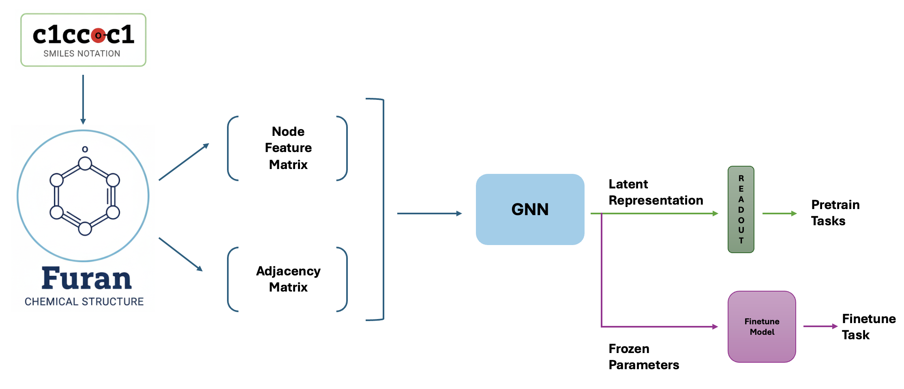

This code is a toy example of how a pretraining-finetuning network works for **Molecular Representation Learning (MRL)**. Two toy datasets have been made for this demo purpose, one for pretraining containing 20 molecules and one for finetuning containing 10 molecules.

The following pipeline illustrates this **Molecular Representation Learning** approach:

* **Input Stage:** Molecules are converted into **Node Feature Matrices** and **Adjacency Matrices** to represent chemical properties and connectivity. Here for Node features, **Atomic Number, Aromaticity and Atomic Degree** have been used. No Bond Feature have been used in this toy example, but many more both bond and node features can also be used.

* **Backbone:** A Graph Neural Network (GNN) processes these inputs to generate a **Latent Representation**. Here, the **Graph Isomorphism Network** (GIN) have been used as the GNN backbone.

* **GNN Training:** For pretraining, the simple task of predicting **Molecular Weight** have been used here.

* **Transfer Learning:** The GNN parameters are **frozen** after pretraining, ensuring that the learned chemical embeddings are preserved while the downstream **Finetune Model** learns specific activity cliff targets.

* **pretrain_data.py and finetune_data.py**  
  These scripts manage the graph-theoretical transformation of molecular data. They parse raw SMILES strings into topological graphs, representing atoms as nodes and bonds as edges.  
  **Featurization:** Using **featurizers.py**, the scripts extract high-dimensional node feature matrices (encoding atomic properties) and adjacency matrices (encoding structural connectivity).

* **pretrain_model.py**  
  This script is used for training the pretrained model and the model weights having the best loss is saved.

* **finetune_model.py**  
  Implements a frozen-backbone architecture. It takes the latent embeddings from the pretrained model and passes them through a regression head to predict specific downstream properties.

The code will run in both GPU and CPU.

To replicate the results or run the demo, follow these steps:

1. Install Dependencies:

pip install -r requirements.txt

2. Execute the Pipeline:

chmod +x demo.sh

./demo.sh